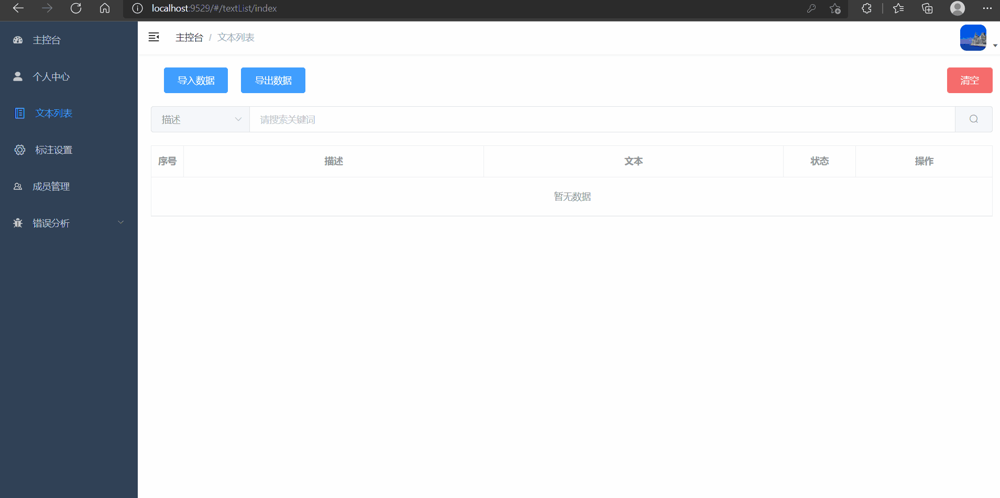

# 医疗文本标注和处理系统
## 简介
医疗文本标注和处理系统，包含标注，后台管理，错误分析等功能
> 本项目目前处于开发阶段  
> 为避免频繁打包，在开发阶段采用前后端分离，到部署时再合并   
> 所写接口仅为前后端交互的示例，可以按实际情况进行修改  
## 拟开发的功能
* 机器学习自动化标注
* 实体标注  

## 开发环境一览:

| 项目 | 版本号 |
| ----| ----|
|python |3.9|
|django|3.1.7|
|node|14.15.3|

> 开发环境不一定要一模一样，版本相近即可    

## 部分功能演示(只完成了部分接口，所以有些功能还用不了)
- 上传标注文本
<p align="center">
  
</p>

- 错误分析
<p align="center">
  
</p>

## 使用方法
* 下载或克隆源码
* 进入到backend文件夹中(manage.py所在目录)
* 先安装一下依赖
```
pip3 install -r requirements.txt
```
* 然后执行以下命令运行后端服务器
```
python manage.py runserver
```
* 新建终端，进入到frontend文件夹中
* 在命令行中输入以下命令，会打开前端页面
```
npm install
npm run serve
```

## License  
MIT
