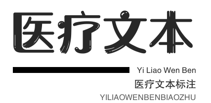

<div align="center">

</div>

# 医疗文本标注和处理系统
## 拟开发的功能
* 实体标注
* 属性标注
* 关系标注
* 翻译

## 注意:  
>  本项目处于开发阶段，目前还用不了  
>   甚至连后端都没有搭起来  
> 目前界面惨不忍睹，后期会美化  
> 敬请期待


## 开发环境一览:

| 项目 | 版本号 |
| ----| ----|
|python |3.9|
|django|3.1.3|
| npm|6.14.8|

> 注:  
> 开发环境不一定要一模一样  
> 版本相近即可

## 使用方法
* 下载源码
* 在命令行中进入到annotation文件夹中
* 在命令行中输入以下命令，会打开前端页面
```
npm install
npm run dev
```
* 如果要搞后端，还有再输入以下命令
```
npm run build
cd ..
python manage.py runserver
```
* 在浏览器地址栏输入127.0.0.1:8000